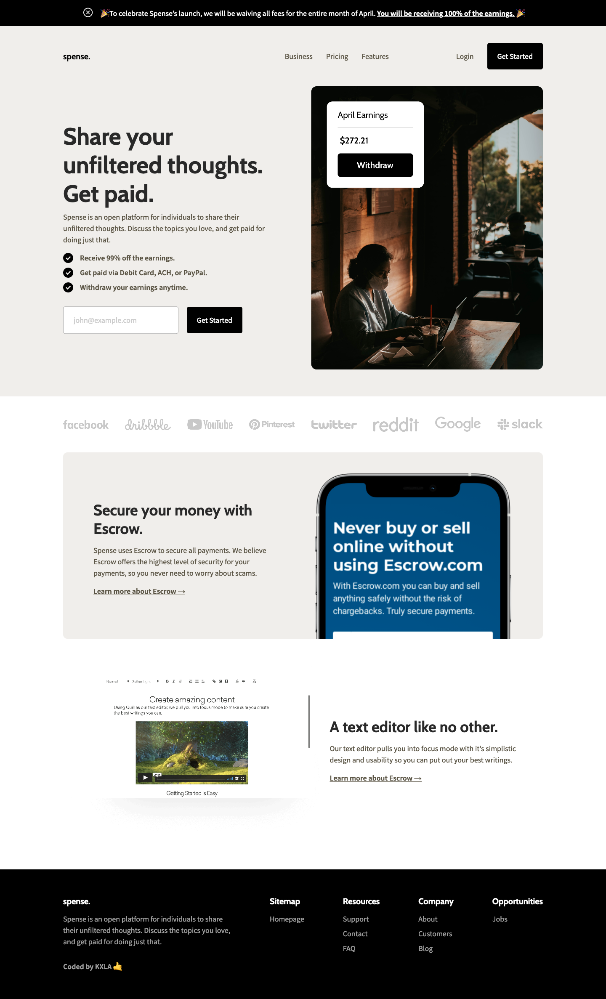

# Codewell - Fiber Landing Page 

This is a solution to the [Spense Landing Page](https://www.codewell.cc/challenges/spense-landing-page--608a7a859691700015db16c5). Codewell challenges help you Improve your HTML and CSS skills by practicing on real design templates.

## Table of contents

- [Overview](#overview)
  - [The challenge](#the-challenge)
  - [Screenshot](#screenshot)
  - [Links](#links)
- [My process](#my-process)
  - [Built with](#built-with)
  - [What I learned](#what-i-learned)
- [Author](#author)


## Overview

### The challenge

Users should be able to:

- View the optimal layout for the site depending on their device's screen size

### Screenshot



### Links

- Solution URL: [Github Repo](https://github.com/KXLAA/CW-03-spense)
- Live Site URL: [Live Preview](https://kxlaa.github.io/CW-02-fiber/)

## My process

### Built with

- Semantic HTML5 markup
- CSS custom properties
- Flexbox
- SCSS


### What I learned
Another fantastic challenge from codewell. The implementation of the design in code was quite straight forward, good practice for responsive layouts. I implemented my scss Media queries differently in this project to make them more maintainable:

```scss
    /**************************/
    /* BELOW 768px (Tablet) */
    /**************************/

    @include respond-to(sm){
        @include flex-center-column;
        flex-direction: column-reverse;
    }
```

I will be maintaining this approach for future projects.


## Author

- Website - [KXLA 🤙](https://github.com/KXLAA)

